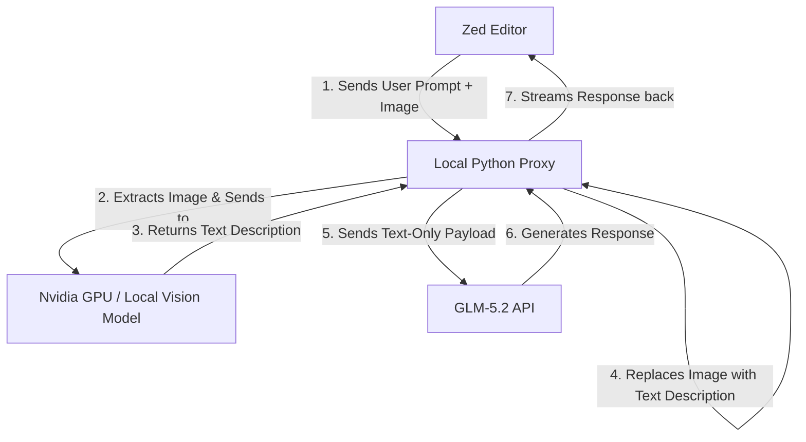

# Vision Proxy Server for Zed (GLM-5.2 & DeepSeek)

This is a zero-dependency Python proxy server that enables you to attach images and screenshots in the Zed AI Assistant/Agent panel, even when using text-only models (like **GLM-5.2** or **DeepSeek**).



---

## Quick Start in 3 Steps

### Step 1: Start a Local Vision Model

Make sure you have a local vision model running on your machine (usually powered by your Nvidia GPU via your local model runner):

```bash
ollama run minicpm-v
# (or ollama run llava / qwen2.5-vl)
```

### Step 2: Start the Proxy Server

Open your terminal and run the server (it runs on port `8099`):

```bash
python3 vision-proxy/proxy.py
```

_(Optional: If you are using a vision model other than `minicpm-v`, specify it using environment variables)_:

```bash
VISION_MODEL="llava" python3 vision-proxy/proxy.py
```

### Step 3: Configure Zed Settings

Open your Zed settings file (`settings.json`) by pressing `Cmd + ,` and choosing "Open Settings File".

Add the following config under `"language_models"` (this replaces the standard OpenAI setup to point to the local proxy instead):

```json
  "language_models": {
    "openai": {
      "api_url": "http://localhost:8099/v1/",
      "available_models": [
        {
          "name": "glm-5.2",
          "max_tokens": 200000,
          "max_output_tokens": 32000,
          "max_completion_tokens": 200000,
          "reasoning_effort": "medium",
          "capabilities": {
            "tools": true,
            "images": true, // Enables image upload button in Zed
            "parallel_tool_calls": true,
            "prompt_cache_key": true,
            "chat_completions": true,
            "interleaved_reasoning": false,
            "max_tokens_parameter": true
          }
        },
        {
          "name": "deepseek-v4-flash",
          "max_tokens": 200000,
          "max_output_tokens": 32000,
          "capabilities": {
            "tools": true,
            "images": true, // Enables image upload button in Zed
            "parallel_tool_calls": true,
            "prompt_cache_key": true,
            "chat_completions": true
          }
        },
        {
          "name": "deepseek-v4-pro",
          "max_tokens": 200000,
          "max_output_tokens": 32000,
          "capabilities": {
            "tools": true,
            "images": true, // Enables image upload button in Zed
            "parallel_tool_calls": true,
            "prompt_cache_key": true,
            "chat_completions": true
          }
        }
      ]
    }
  }
```

---

## How to Use it in Zed

1. Open the Zed Assistant panel (`Cmd + R` or click the AI icon).
2. Select your provider in the dropdown:
   - Choose **`GLM-5.2`** to use GLM-5.2 via proxy.
   - Choose **`DeepSeek (Proxy)`** to use DeepSeek via proxy.
3. Select your desired model (e.g. `glm-5.2` or `deepseek-v4-flash`).
4. Use the paperclip icon or drag-and-drop to attach screenshots/images.
5. The proxy will automatically describe the images and format the payload correctly before sending it to the APIs.

---

## How it works under the hood

1. **Dynamic Routing**: The proxy automatically checks the requested `"model"`. If the name contains `"deepseek"`, it routes the request to the official DeepSeek API. Otherwise, it routes the request to Z.AI (GLM).
2. **Vision Conversion**: When you upload an image, the proxy converts it into a base64 string, sends it to the local vision server, gets a description, and replaces the image block with:
   `[User uploaded an image. Vision Model Description: <description>]`
3. **Format Correction**: It strips any remaining image block objects and automatically formats the conversation history (like previous assistant replies) into clean strings, preventing standard API payload errors.

---

## How to Know What is Working

### 1. By Looking at the Proxy Terminal Console

When you run the proxy server in a terminal, it prints exactly what it is doing in real-time. When you send a message in Zed, you will see output like this:

- **When routing to GLM-5.2**:
  ```text
  [*] Routing request to Z.AI GLM API (glm-5.2)...
  127.0.0.1 - - [01/Jul/2026 19:42:01] "POST /v1/chat/completions HTTP/1.1" 200 -
  ```
- **When routing to DeepSeek**:
  ```text
  [*] Routing request to DeepSeek API (deepseek-v4-flash)...
  127.0.0.1 - - [01/Jul/2026 19:42:15] "POST /v1/chat/completions HTTP/1.1" 200 -
  ```
- **When you attach an image/screenshot**:
  ```text
  [*] Calling vision model (minicpm-v) to describe image...
  [+] Vision model description retrieved successfully.
  ```
- **When an image is re-sent in history (Caching)**:
  ```text
  [*] Found cached image description (hash: 93426323a732b7d6d7959ed7e512cb10)
  [*] Found cached image description (hash: 2670a26eb8de9044112a3d148d88abb3)
  [*] Routing request to Z.AI GLM API (glm-5.2)...
  ```
  This indicates the proxy is reusing descriptions from memory instead of repeating duplicate API calls, saving latency and API cost.

### 2. In the AI Chat response

- **If the vision model is active**: The AI assistant (GLM or DeepSeek) will describe details from your screenshot or image naturally.
- **If the vision model is offline / local vision server is not running**: The AI assistant will tell you it received a connection error:
  > _"I apologize, but I am unable to see the image. The system encountered a connection error: [Errno 61] Connection refused..."_
